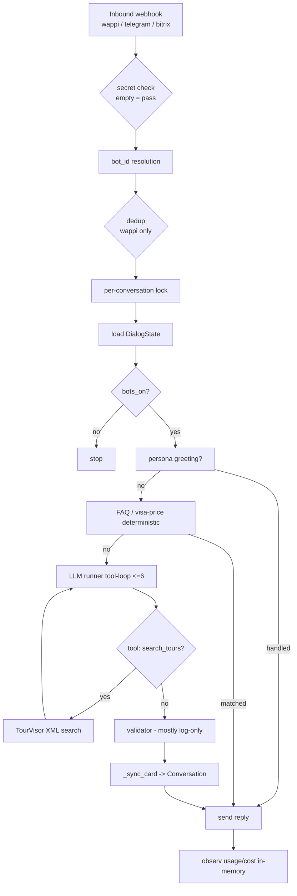
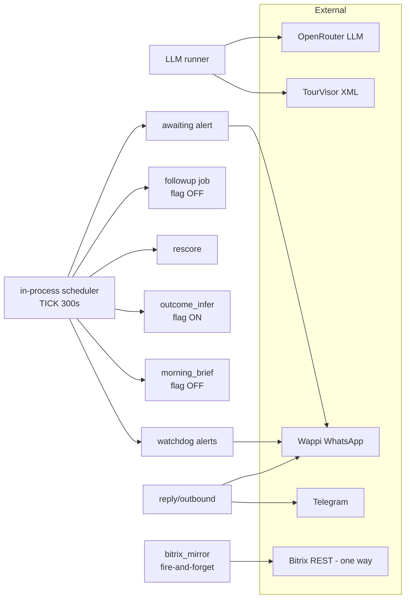

# AS-IS ARCHITECTURE — Provisional

> Status: PROVISIONAL AS-IS
> Repository baseline: a4edd5a824db6842b668f61e50f418f75b555f99
> Production snapshot: 2026-07-15T23:25–23:28Z
> Production image: sha256:1be488a9ca8e…
> Exact production source commit: UNKNOWN
> This document describes current state and does not approve target implementation.

## Overview

A single FastAPI monolith (`app/`, Python 3.12) `[CODE-CONFIRMED]`. It ingests messages via webhooks, runs a deterministic pre-LLM layer, then an LLM agent loop with tools, validates the reply, persists a panel card, and sends the reply back on the originating channel. Background jobs run on an in-process scheduler.

## Components (as-is)

- **Webhooks** (`app/main.py`): `POST /webhook/wappi`, `POST /webhook/telegram[/{bot_id}]`, `POST /webhook/bitrix`, `GET /health` `[CODE-CONFIRMED]`.
- **Orchestrator** (`app/core/orchestrator.py`): per-conversation `asyncio.Lock`, dedup (Wappi only), state load, bots on/off resolution, persona greeting, FAQ/visa-price short-circuits, funnel dispatch, card sync, reply, failure counters `[CODE-CONFIRMED]`.
- **Deterministic FAQ / visa-price layer** (`app/core/faq.py`, `app/core/visa_pricing.py`): pattern/negative-term matcher and country-scoped visa prices that can answer **before** the LLM (0 LLM calls) `[CODE-CONFIRMED]`.
- **LLM runner** (`app/agent/runner.py`, `app/agent/llm.py`): OpenRouter (OpenAI-compatible), tool loop up to `MAX_TOOL_ITERATIONS=6`, history window 40, temperature 0.3, max_tokens 512, no retries, no summarization `[CODE-CONFIRMED]`.
- **TourVisor tool loop** (`app/integrations/tourvisor/client.py`): tool `search_tours` → XML gateway `search.php`→`result.php` polling; returns human-readable strings; results ephemeral (not persisted structurally) `[CODE-CONFIRMED]`.
- **Validator** (`app/agent/validator.py`): mostly log-only; auto-fixes markdown, unknown URLs, tours price disclaimer, and two hardcoded sentence rewrites; does not block invented price/visa-term/discount `[CODE-CONFIRMED]`.
- **Reply channel** (`app/channels/*`, `app/channels/outbound.py`): Wappi / Telegram / Bitrix OpenLines adapters; text-only `[CODE-CONFIRMED]`.
- **PostgreSQL** (`app/integrations/crm/db.py`): panel store (Conversation/Message), Deal, FaqEntry, AuditLog, AppFlag; runtime `PostgreSQL 16.14` `[CODE-CONFIRMED]` + `[RUNTIME-CONFIRMED]`.
- **Redis** (`app/core/state.py`): DialogState with 7-day TTL; runtime `7.4.9`, AOF enabled `[CODE-CONFIRMED]` + `[RUNTIME-CONFIRMED]`.
- **Scheduler** (`app/core/scheduler.py`): in-process asyncio loop, TICK 300s; jobs watchdog/awaiting/followup/rescore/outcome_infer/morning_brief `[CODE-CONFIRMED]`.
- **Bitrix mirror** (`app/integrations/crm/bitrix_mirror.py`): fire-and-forget one-way mirror to Bitrix Lead + timeline comments; gated by `bitrix_mirror_enabled` `[CODE-CONFIRMED]` (flag ON in runtime `[RUNTIME-CONFIRMED]`).
- **Admin panel** (`app/admin/router.py`, `app/admin/templates/`): Jinja2 + HTMX + SortableJS (CDN), kanban/chat/buyers/morning/analytics/system/audit/faq/login `[CODE-CONFIRMED]`.

## Diagram 1 — Synchronous message flow (as-is)

## Diagram 2 — Background jobs and external integrations (as-is)

Notes:
- No target components are shown; this reflects current code + runtime only.
- Bitrix mirror is one-directional (write to Lead + comments); no CRM ingestion path exists `[CODE-CONFIRMED]`.
