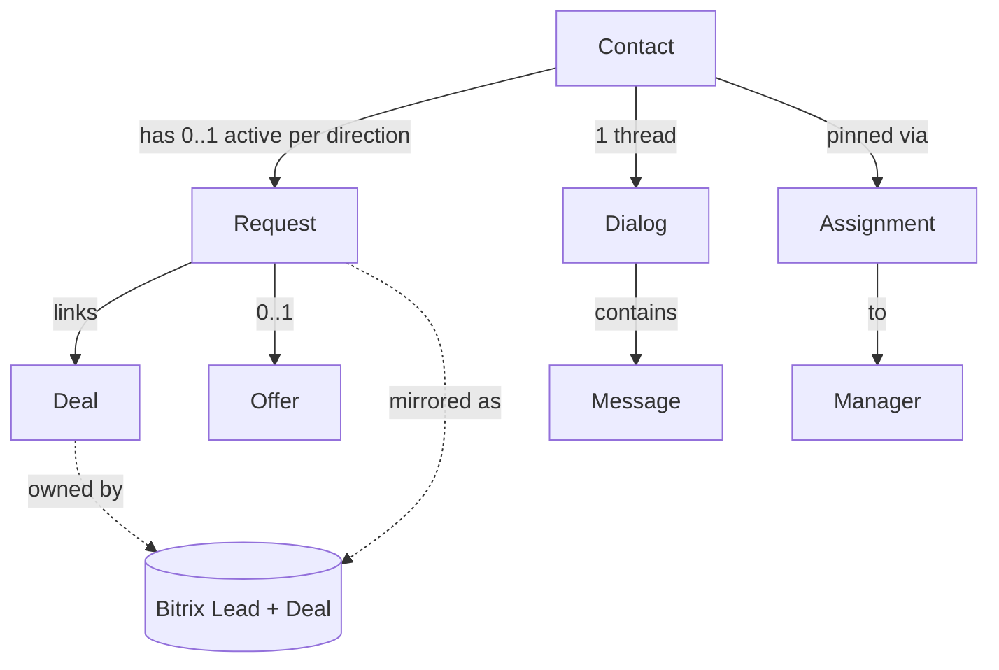
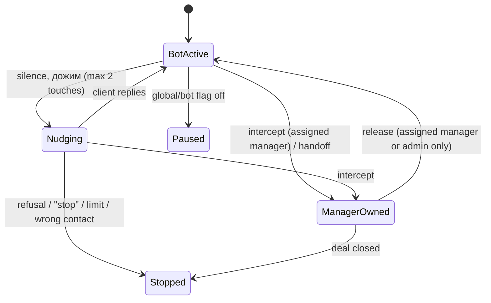
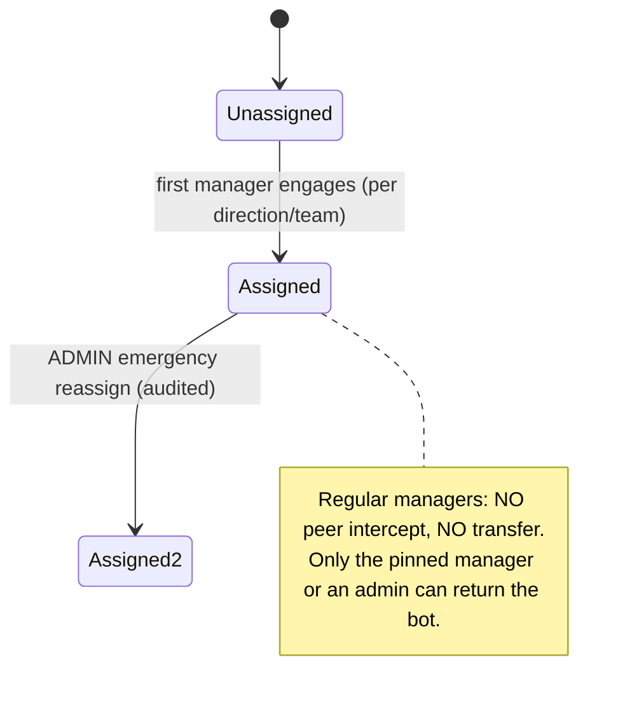
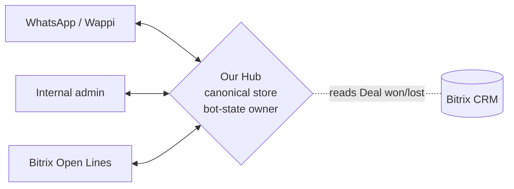

# TARGET DESIGN — Phase 2

> Status: PROPOSED TARGET DESIGN — NOT APPROVED
> Baseline (provisional as-is) commit: 574126049531ff75cd23d607dc034613411f9c44 (5741260)
> Based on: Phase 1 Business Discovery decisions (16.07.2026)
> Approval: decisions #1/#4/#8 = OWNER-APPROVED (Alan) / TEAM-VALIDATION-PENDING (Гриша + managers)
> NOT approved for implementation. No permission for code, migrations, implementation branch, rollout, or production/app-flag changes.
> This document designs target entities, state machines, the two-way sync contract, and the pinned-ownership model only. It does not modify any Phase 1 decision.

## 0. Design invariants (from Phase 1)

1. **Bitrix owns the customer record and the sale:** Lead + Deal. A sale = a completed Deal in Bitrix.
2. **Our system owns dialog control:** bot phase, `dialog_owner`, pause, intercept, AI-phase — never mutated by Bitrix or WhatsApp.
3. **Chat is two-way synced** across three surfaces (WhatsApp ↔ internal admin ↔ Bitrix Open Lines); a reply from any surface appears in all three.
4. **Two separate axes:** business funnel status (measures leads/money) is distinct from bot/dialog control.
5. **Manual > bot** for business status (a manager's status is never overwritten by the bot).
6. **One active Request per (client, direction)** — a client may hold a tour Request and a visa Request in parallel, but not two active in the same direction.
7. **Pinned ownership:** a client is pinned to one manager; regular managers cannot intercept/transfer others' dialogs; only a full admin can perform an audited emergency reassignment.
8. **Price policy:** the bot states only a confirmed range/orientation; exact price and any discount are confirmed by a manager.
9. Historical runtime flag states (which bots enabled, work-visas off) are NOT business rules and are not encoded here.

---

## 1. Target domain entities (conceptual — not DB columns)

| Entity | Purpose | Owner of truth | Mirrored to | Notes |
|---|---|---|---|---|
| **Contact** | A person (by phone). Identity anchor across directions. | Our hub (phone-keyed) + Bitrix Lead/Contact ref | Bitrix | Dedupes a human across their Requests; today [NOT FOUND] as an entity. |
| **Lead** | Interested person in Bitrix terms. | **Bitrix** | Our hub keeps `bitrix_lead_id` | Created on first contact (mirror already does this). |
| **Request** *(NEW)* | One active engagement in one direction (tours \| visa \| tickets). Holds qualification, funnel sub-stage, assigned manager, linked Deal. | Our hub | Bitrix (as Lead/Deal fields) | The missing entity that separates "chat/lead" from "the thing being sold". One active per (Contact, direction). |
| **Deal** | The sale. | **Bitrix** | Our hub reads `won/lost` back | Manager completes it in Bitrix; hub ingests state → metrics. Closes the "sales not measured" gap. |
| **Offer** *(optional)* | Snapshot of a selected tour option (hotel/price/date) for a tours Request. | Our hub | — | Optional; makes "the 2nd hotel" re-referenceable. Not required for MVP of the design. |
| **Payment** | Money movement. | **Bitrix** (part of Deal) | — | We do not own payments. |
| **Dialog** | The chat thread + bot control state (phase, owner, pause, intercept). | **Our hub** | mirrored text only | Links to Contact + current Request. Bitrix never mutates its control state. |
| **Message** | One chat line, synced across surfaces. | Our hub (canonical) | WhatsApp + Bitrix | Carries origin surface + dedup/idempotency key. |
| **Assignment** | Pins a Contact/Request to a manager; keeps reassignment history. | Our hub | — | Enables pinned ownership + audited emergency reassign. |

### Entity relationships

---

## 2. State machines

Three **independent** axes. They must not be collapsed into one column set (today's defect).

### 2a. Business funnel status — common frame + per-direction sub-stages

Common frame (measurable for leads → money):
`New → Qualifying → Proposal/Selection → Office/Consultation → Deal → (Won | Lost)`

- **Won/Lost is set by the Bitrix Deal** (ingested), not by a panel guess.
- **Manual > bot:** a manager may move the Request; the bot may only *propose* a stage and never overwrites a manager-set stage.

Direction-specific sub-stages hang off the common frame:

### 2b. Bot / dialog control (OURS — separate axis)

- **Дожим stop conditions (#9):** explicit refusal, "don't write me", manager intercept, closed deal, wrong contact, or 2-touch limit. Requires a new **refusal detector** (absent today).
- Control state lives only in our hub; a Bitrix operator "joining" surfaces as an *intercept signal*, but the authoritative `intercepted`/owner flags are ours.

### 2c. Ownership state

- **Emergency reassignment** (admin only) records: actor, from→to, reason, timestamp. Prevents "clients of a departed manager blocked forever."

---

## 3. Two-way sync contract (WhatsApp ↔ admin ↔ Bitrix Open Lines)

**Topology: hub-and-spoke.** Our system is the single **hub/broker**; WhatsApp (via Wappi) and Bitrix Open Lines are **edges**. All cross-surface propagation goes through the hub — never edge-to-edge — to avoid N×N loops.

### Message envelope (conceptual)
`{ hub_msg_id, origin_surface, direction(in|out), sender_role(client|bot|manager), text, ts, contact_ref, request_ref, origin_idempotency_key }`

> NOTE: R4 (durable dedup), R5 (anti-loop), R8 (durable outbox) and R9 (retry) are **TARGET REQUIREMENTS of this design — NOT implemented today** (as-is has only in-memory Wappi dedup, no Bitrix dedup, no durable outbox, no retry).

### Rules
- **R1 — Client inbound (WhatsApp):** hub stores canonical message → fan-out to admin + Bitrix.
- **R2 — Manager reply (from admin OR Bitrix):** hub sends to client on WhatsApp → reflects into the other two surfaces.
- **R3 — Bot reply:** hub sends to WhatsApp → reflects into admin + Bitrix.
- **R4 — Dedup:** every inbound carries a stable `origin_idempotency_key`; hub keeps a durable seen-set keyed by `(surface, origin id)`; a already-seen message is dropped (today Wappi dedup is in-memory; Bitrix has none — target = durable, per-surface).
- **R5 — Loop prevention:** every hub-originated outbound is tagged with our key; when a surface echoes it back (e.g. Wappi own-echo, Bitrix imbot echo), the hub recognizes its own key and does not re-ingest it as new.
- **R6 — State ownership boundary:** bot phase, `dialog_owner`, pause, intercept, AI-phase are mutated ONLY by the hub. Bitrix/WhatsApp events can *signal* (e.g. operator joined) but never write control state directly.
- **R7 — Single broker:** edges never talk to each other; only hub↔edge. This is what makes loop prevention tractable.
- **R8 — Durable outbox:** outbound to each surface goes through a durable outbox with idempotency keys + ordering by hub receipt — closes today's "no durable outbox / no outbound idempotency" gap.
- **R9 — Failure/retry:** per-surface propagation retries with backoff; pending/failed tracked in the outbox and observable (fixes "fire-and-forget, no retry").
- **R10 — Sale ingestion:** Deal `won/lost` flows **Bitrix → hub** (new ingestion path). Manager completes the Deal in Bitrix; hub reads it back to mark the Request terminal and feed metrics.

### Ownership of truth per item

| Item | Owner of truth | Synced/mirrored |
|---|---|---|
| Chat messages | Hub (canonical) | WhatsApp + Bitrix (both directions) |
| Bot phase / owner / pause / intercept / AI-phase | **Hub only** | not exported |
| Business funnel status (Request) | Hub | reflected to Bitrix Lead fields |
| Customer / Lead identity | Bitrix | `bitrix_lead_id` in hub |
| Deal / sale / payment | **Bitrix** | won/lost ingested to hub |
| Assignment / ownership | Hub | shown in all surfaces (read-only) |

---

## 4. Pinned-ownership model (detail)

- **Assignment unit:** per (Contact, direction). Because of hybrid working (#1), a visa Request is owned by a visa manager (Bitrix surface), a tour Request by a tour manager (WhatsApp/panel surface). Same human can thus have a visa manager and a tour manager.
- **Regular manager rights:** see + reply only to their assigned Contacts/Requests; **no peer intercept, no transfer**.
- **Admin rights:** audited **emergency reassignment** (vacation/illness/termination), and returning the bot to a dialog.
- **Bot return:** only the pinned manager or an admin may release a dialog back to the bot.
- **Invariant:** no dialog can become permanently unanswerable — admin reassignment is always available as the escape hatch.

---

## 5. Gap-to-target map (what the design implies must change — later, not now)

| Today (as-is) | Target |
|---|---|
| Conversation = lead = chat = one funnel | Contact + Request(per direction) + Dialog separated |
| One-way Bitrix mirror, no ingestion | Two-way sync hub + Deal won/lost ingestion |
| `assigned_to` soft, peer-overwrite on 2/3 paths | Pinned assignment; peer transfer blocked; admin-only audited reassign |
| Drag overwritten by bot (`_sync_card`) | Manual status authoritative; bot proposes only |
| No durable outbox / in-memory dedup | Durable outbox + durable per-surface dedup/idempotency |
| No refusal detector | Refusal/stop detector for дожим |
| Prices editable by any manager; code/panel divergence | Only owner/admin publishes; single price source |

---

## 6. Open items — TEAM VALIDATION PENDING (#1/#4/#8)

1. **Workplace (#1):** confirm visa managers work fully in Bitrix and tour managers in WhatsApp/panel.
2. **Pinning (#4):** confirmed — no peer transfer, admin emergency reassignment with audit.
3. **FAQ/prices (#8):** confirm only owner + admin publish; managers may only submit a change proposal.

Plus unknowns unchanged from Phase 0C (live CTWA schema, exact prod source commit, backup/restore, TLS/proxy specifics).

## 7. Explicitly NOT in this phase
No code, no migrations, no implementation branch, no rollout, no production or app-flag changes. This is design for review; implementation waits on team validation + a separate approved plan.
