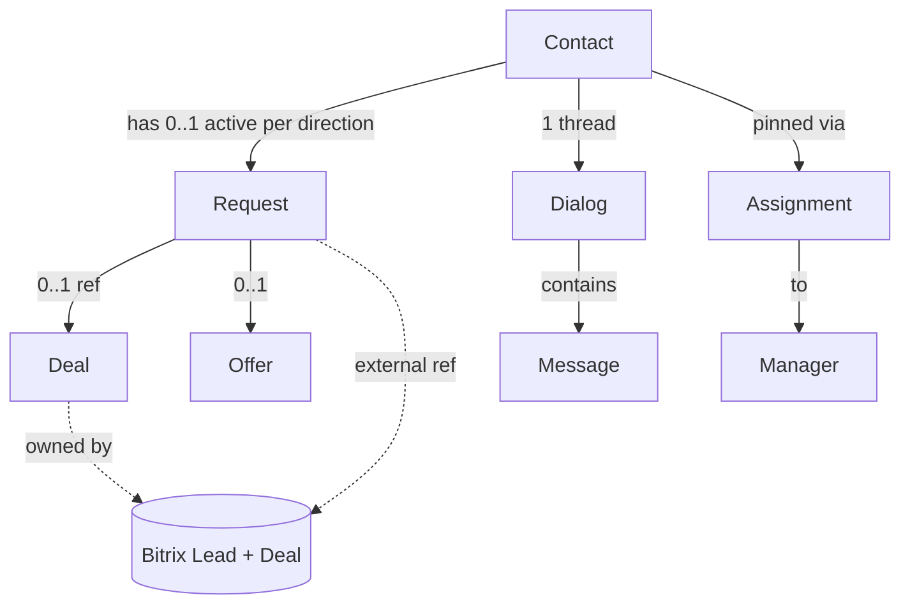
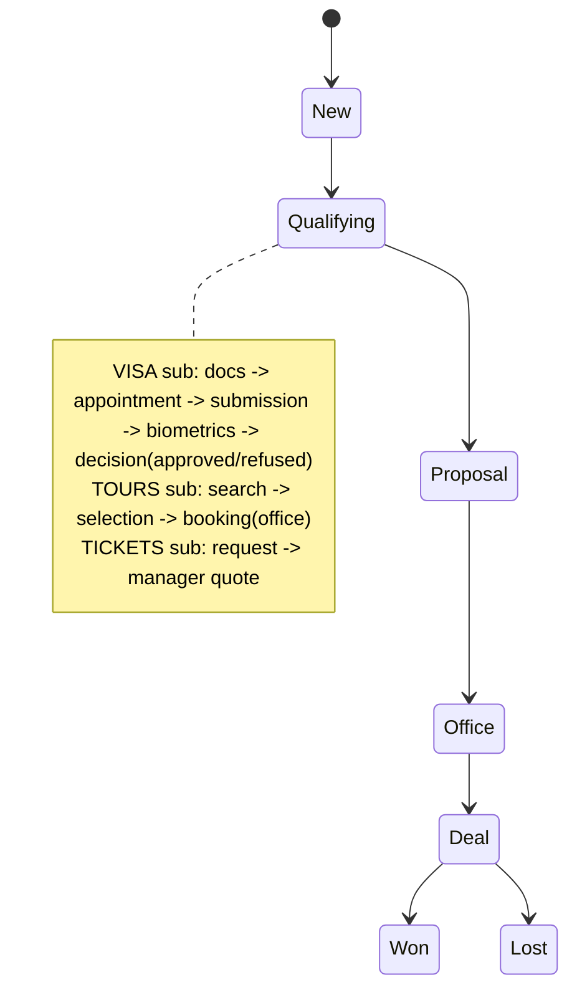
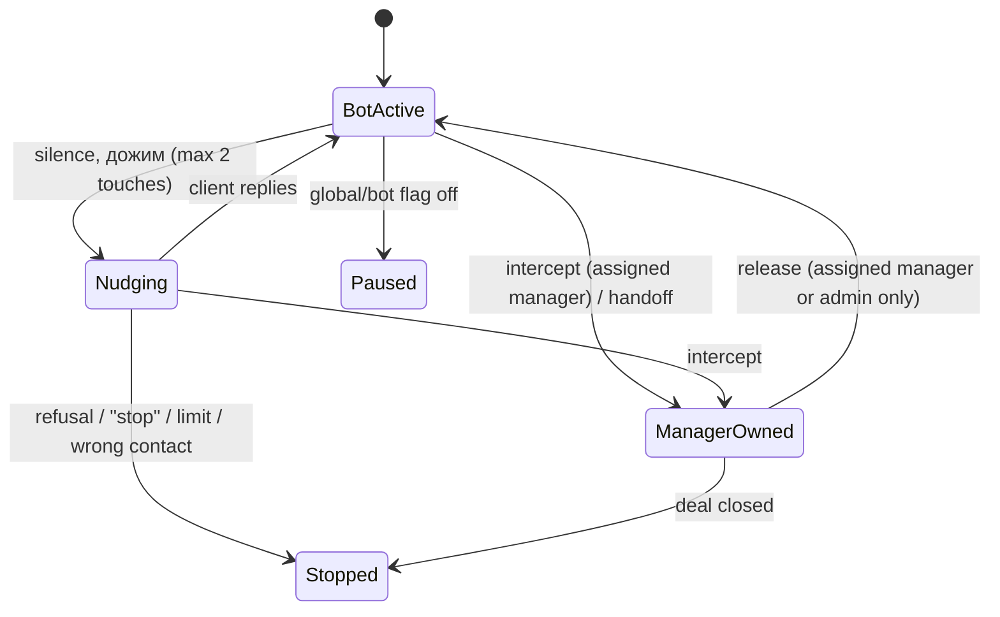
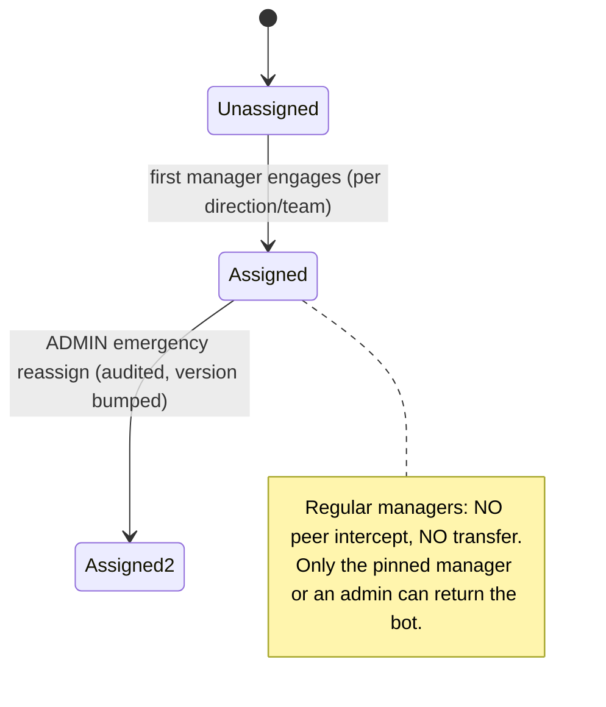
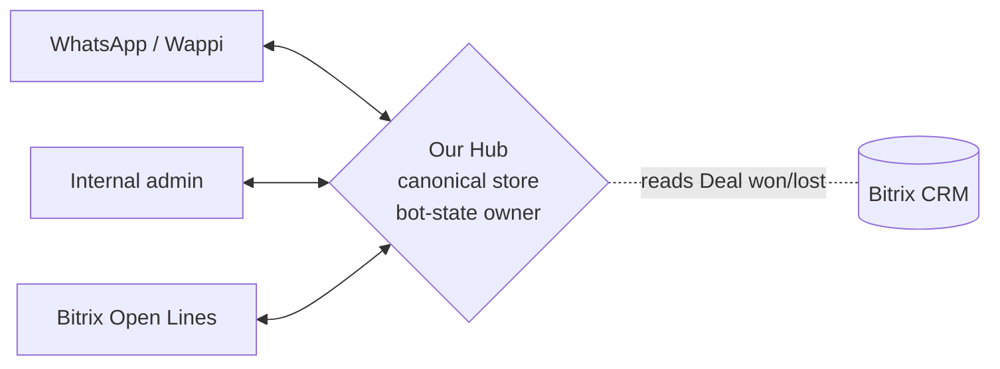

# TARGET DESIGN — Phase 2

> Status: PROPOSED TARGET DESIGN — NOT APPROVED
> Review state: AWAITING FINAL MINOR VERIFICATION (Phase 2.3 applies the two minor review corrections)
> Baseline (provisional as-is) commit: 574126049531ff75cd23d607dc034613411f9c44 (5741260)
> Based on: Phase 1 Business Discovery decisions (16.07.2026)
> Approval: decisions #1/#4/#8 = OWNER-APPROVED (Alan) / TEAM-VALIDATION-PENDING (Гриша + managers)
> NOT approved for implementation. No permission for code, migrations, implementation branch, rollout, or production/app-flag changes.
> This document designs target entities, state machines, the two-way sync contract, and the pinned-ownership model only. It does not modify any Phase 1 decision.

## 0. Design invariants (from Phase 1)

1. **Bitrix owns the customer record and the sale:** Lead + Deal. A sale = a completed Deal in Bitrix. (Bitrix does NOT own the whole system — see §16.)
2. **Our system owns dialog control:** bot phase, `dialog_owner`, pause, intercept, AI-phase — never mutated by Bitrix or WhatsApp.
3. **Chat is two-way synced** across three surfaces (WhatsApp ↔ internal admin ↔ Bitrix Open Lines); a reply from any surface appears in all three.
4. **Two separate axes:** business funnel status (measures leads/money) is distinct from bot/dialog control and from assignment (three axes — see §2).
5. **Manual > bot** for business status (a manager's status is never overwritten by the bot).
6. **One active Request per (Contact, direction)** — a client may hold a tour Request and a visa Request in parallel, but not two active in the same direction.
7. **Pinned ownership:** a client is pinned to one manager; regular managers cannot intercept/transfer others' dialogs; only a full admin can perform an audited emergency reassignment.
8. **Price policy:** the bot states only a confirmed range/orientation; exact price and any discount are confirmed by a manager (enforced by the blocking gate — see §9).
9. Historical runtime flag states (which bots enabled, work-visas off) are NOT business rules and are not encoded here.

---

## 1. Target domain entities (conceptual — not DB columns)

| Entity | Purpose | Owner of truth | Mirrored to | Notes |
|---|---|---|---|---|
| **Contact** | A person (identity anchor across directions/channels). | Our hub | Bitrix Lead ref | Dedupes a human across Requests; today [NOT FOUND] as an entity. See §1a. |
| **Lead** | Interested person in Bitrix's commercial terms. | **Bitrix** | Our hub keeps a lead reference | External projection of a Contact; not a replacement for Contact. |
| **Request** *(NEW)* | One active engagement in one direction (tours \| visa \| tickets). Holds `request_id`, qualification, funnel sub-stage, references. | Our hub | Bitrix (via reference) | Separates "chat/lead" from "the thing being sold". One active per (Contact, direction). Correlation contract in §8. |
| **Deal** | The sale (commercial state). | **Bitrix** | Our hub reads `won/lost` back | Manager completes it in Bitrix; hub ingests state → metrics (§8). |
| **Offer** *(optional)* | Snapshot of a selected tour option for a tours Request. | Our hub | — | Optional; not required for the MVP of this design. |
| **Payment** | Money movement. | **Bitrix** (part of Deal) | — | We do not own payments. |
| **Dialog** | The chat thread + bot control state (phase, owner, pause, intercept). | **Our hub** | mirrored text only | Links to Contact + current Request. Bitrix never mutates its control state. |
| **Message** | One chat line, synced across surfaces. | Our hub (canonical) | WhatsApp + Bitrix | Carries origin surface + dedup/idempotency key. |
| **Assignment** | Pins a Contact/Request to a manager; carries an assignment version and reassignment history. | Our hub | shown read-only in all surfaces | Enables pinned ownership + audited emergency reassign (§7). |

### 1a. Contact vs Bitrix Lead (clarification — finding m4)
- **Contact** is the **internal identity anchor** for a person. It is **independent of `bot_id`** and links phone numbers and other channel identities.
- Contact normalization/merge requires **audit**.
- **Bitrix Lead** is an **external commercial CRM entity**; it is **not a replacement** for the internal Contact.
- The link is stored as an **external reference / mapping**, not by making one the other.
- Phone updates and merges performed in Bitrix require **reconciliation** on our side.
- A **Bitrix Lead has no authority** to change bot mode or Assignment.

### Entity relationships

---

## 2. State machines

Three **independent** axes. They must not be collapsed into one column set (today's defect): **(A) Request business status**, **(B) bot/dialog mode**, **(C) assignment/ownership**.

### 2a. Business funnel status — common frame + per-direction sub-stages
Common frame: `New → Qualifying → Proposal/Selection → Office/Consultation → Deal → (Won | Lost)`
- **Won/Lost is set by the Bitrix Deal** (ingested — §8), not by a panel guess.
- **Manual > bot:** a manager may move the Request; the bot may only *propose* a stage and never overwrites a manager-set stage.

### 2b. Bot / dialog control (OURS — separate axis)

- **Дожим stop conditions (#9):** explicit refusal, "don't write me", manager intercept, closed deal, wrong contact, or 2-touch limit. Requires a new **refusal detector** (absent today).
- Control state lives only in our hub; a Bitrix operator "joining" surfaces as an *intercept signal*, but the authoritative `intercepted`/owner flags are ours.

### 2c. Ownership state

- **Emergency reassignment** (admin only) records: actor, from→to, reason, timestamp; bumps assignment version (§7).

---

## 3. Two-way sync contract (WhatsApp ↔ hub ↔ Bitrix Open Lines)

**Topology: hub-and-spoke.** Our system is the single **hub/broker**; WhatsApp (via Wappi) and Bitrix Open Lines are **edges**. All cross-surface propagation goes through the hub — **never edge-to-edge** — to avoid N×N loops.

### Message envelope (conceptual)
`{ hub_msg_id, origin_surface, direction(in|out), sender_role(client|bot|manager), text, ts, contact_ref, request_ref, origin_idempotency_key }`

> NOTE: durable inbound inbox (§12), R4 (durable dedup), R5 (anti-loop), R8 (durable outbox) and R9 (retry) are **TARGET REQUIREMENTS of this design — NOT implemented today** (as-is has only in-memory Wappi dedup, no Bitrix dedup, no durable outbox, no retry).

### Rules
- **R1 — Client inbound (WhatsApp):** hub records it in the durable inbound inbox (§12), then fan-out to admin + Bitrix.
- **R2 — Manager reply (from admin OR Bitrix OR any surface):** hub first runs the **pre-send authorization gate (§7)**; only an authorized reply is sent to the client on WhatsApp and reflected into the other surfaces.
- **R3 — Bot reply:** passes the **blocking fact-safety gate (§9)**, then hub sends to WhatsApp → reflects into admin + Bitrix.
- **R4 — Dedup:** every inbound carries a stable `origin_idempotency_key`; hub keeps a **durable** seen-set keyed by `(surface, provider event id)`; an already-seen event is dropped.
- **R5 — Loop prevention:** every hub-originated outbound is tagged with our key; when a surface echoes it back (Wappi own-echo, Bitrix imbot echo), the hub recognizes its own key and does not re-ingest it as new.
- **R6 — State ownership boundary:** bot phase, `dialog_owner`, pause, intercept, AI-phase are mutated ONLY by the hub. Bitrix/WhatsApp events can *signal* but never write control state directly.
- **R7 — Single broker:** edges never talk to each other; only hub↔edge.
- **R8 — Durable outbox:** outbound to each surface goes through a durable outbox with idempotency keys + ordering by hub receipt (logical at-most-once effect — see §14).
- **R9 — Failure/retry:** per-surface propagation retries with backoff; pending/failed tracked and observable.
- **R10 — Sale ingestion:** Deal `won/lost` flows **Bitrix → hub** per the correlation & ingestion contract in §8.

---

## 4. Pinned-ownership model (detail)
- **Assignment unit:** per (Contact, direction). Hybrid working (#1): a visa Request is owned by a visa manager (Bitrix surface), a tour Request by a tour manager (WhatsApp/panel surface).
- **Regular manager rights:** see + reply only to their assigned Contacts/Requests; **no peer intercept, no transfer**.
- **Admin rights:** audited **emergency reassignment** and returning the bot to a dialog.
- **Bot return:** only the pinned manager or an admin may release a dialog back to the bot.
- **Invariant:** no dialog can become permanently unanswerable — admin reassignment is always available.
- Authorization enforcement for outbound is specified in §7.

---

## 5. Gap-to-target map (what the design implies must change — later, not now)

| Today (as-is) | Target |
|---|---|
| Conversation = lead = chat = one funnel | Contact + Request(per direction) + Dialog separated |
| One-way Bitrix mirror, no ingestion | Two-way sync hub + Deal won/lost ingestion (§8) |
| `assigned_to` soft, peer-overwrite on 2/3 paths | Pinned assignment; peer transfer blocked; admin-only audited reassign (§7) |
| Drag overwritten by bot (`_sync_card`) | Manual status authoritative; bot proposes only |
| No durable outbox / in-memory dedup / no inbox | Durable inbound inbox (§12) + durable dedup + durable outbox |
| No refusal detector | Refusal/stop detector for дожим |
| Validator log-only for risky facts | Blocking fact-safety gate (§9) |
| Prices editable by any manager; code/panel divergence | Only owner/admin publishes; single price source (§16) |
| No attribution model | Attribution touch-history + confidence (§10) |
| No STT | Separate one-shot STT service (§11) |

---

## 6. Open items — TEAM VALIDATION PENDING (#1/#4/#8)
1. **Workplace (#1):** confirm visa managers work fully in Bitrix and tour managers in WhatsApp/panel.
2. **Pinning (#4):** confirmed — no peer transfer, admin emergency reassignment with audit.
3. **FAQ/prices (#8):** confirm only owner + admin publish; managers may only submit a change proposal.

Plus unknowns unchanged from Phase 0C (live CTWA schema, exact prod source commit, backup/restore, TLS/proxy specifics).

---

## 7. Manager-message authorization (finding M1)

**Target invariant — before sending ANY manager message, the system MUST:**
1. **Resolve internal manager identity** from the source surface: internal panel; Bitrix; Telegram (if used); internal/public API; WhatsApp profile / manager echo.
2. **Resolve context:** Contact; direction; active Request; current Assignment; assignment version.
3. **Verify the sender** is either the **current pinned manager** OR a **full-admin performing a permitted administrative action**.
4. **On mismatch:** do NOT send to the client; move the event to a **rejected/quarantined** state; write an **audit** record; do NOT mirror it as a valid reply.

**Applies to all surfaces:** internal panel; Bitrix; Telegram; internal/public API; automated manager-send endpoints.

**Admin reassignment MUST:**
- atomically change the Assignment;
- increment the assignment version / revision;
- immediately revoke the previous manager's send right;
- require a reason;
- create an immutable audit record.

**Outbox re-check:** before the actual external send, the outbox worker MUST re-validate the current Assignment/revision.
- If reassignment happened before the external send → the old manager's pending send is **cancelled/rejected**.
- If the message was already sent on the external channel → it **cannot be recalled**; the event is recorded as already-happened; no resend or mirror is performed.

**Native WhatsApp limitation (explicit):** a manager echo arrives **after** the message was already delivered to the client, so the hub **cannot preemptively cancel** a direct reply made from native WhatsApp. Target controls:
- each Wappi/WhatsApp profile is hard-bound to exactly one `manager_id` and one direction;
- a manager has no access to another manager's profile;
- each echo is checked against the Assignment;
- a mismatch creates a **security/audit incident**;
- a mismatch does **not** become a reason to change ownership;
- the hub does **not** re-send the message to the client;
- the message may be surfaced to an administrator as a violation.

This design does **not** claim that an already-sent WhatsApp message can be technically recalled.

**Native WhatsApp & shared number (clarification — finding M-a):**
- Precise **per-manager attribution** of a direct native-WhatsApp message is only possible when **each manager has a separate WhatsApp/Wappi profile or number**.
- If a **shared team number** is used, the hub **cannot always** technically determine which individual sent the message.
- In that mode, only **team-level attribution + post-hoc audit** are available.
- This must **not** automatically change the Assignment.
- The **peer-takeover prohibition still holds** as an organizational and system rule on every surface where **pre-send identity is available** (panel, Bitrix, Telegram, API, automated manager-send).
- The choice between **shared number** and **per-manager profile** is marked **OWNER-APPROVED / TEAM-VALIDATION-PENDING** until confirmed by the team.

---

## 8. Request ↔ Bitrix Lead/Deal correlation (finding M2)

**Each Request has:** an immutable internal `request_id`; a `direction`; a Contact reference.

**Linkage:** a Bitrix Lead and Deal must be unambiguously linked to a Request via **either** the internal `request_id` carried in a dedicated external field **or** a durable integration mapping record. *(A specific Bitrix custom-field name is NOT fixed as approved implementation.)*

**Target cardinality:**
- one Contact may have **multiple historical** Requests;
- at most **one active** Request per direction at a time;
- one Request has **0..1 current** Bitrix Lead reference;
- one Request has **0..1 current** Bitrix Deal reference;
- old, merged, or replaced references are **kept in history**;
- one external Deal **cannot** be linked to two Requests.

**Deal event ingestion:**
- uses the **provider event ID** as the dedup key;
- if the provider event ID is absent → a **documented stable fallback fingerprint** is used;
- the same event **cannot** create a confirmed sale twice;
- each event stores an **external updated timestamp/version**;
- a **late** event must not regress a newer state;
- **out-of-order** events are stored and processed by version rules;
- an event arriving **before mapping exists** goes to an **unmatched/pending inbox** and is re-matched once the mapping appears;
- Deal won/lost is applied **idempotently**.

**Conflict policy:**
- Bitrix is authority for **Deal commercial state and confirmed sale**;
- Bitrix is **not** authority for bot mode, dialog ownership, or Assignment;
- other Bitrix stages do **not** auto-overwrite the Request unless a separately approved mapping rule exists;
- **manual** Deal changes in Bitrix pass through the same ingestion, dedup, ordering, and audit;
- a **deleted/merged** Deal requires reconciliation, not a silent new sale.

**Explicit:** a Bitrix Deal `won` does NOT automatically mean visa approval, visa-process completion, confirmed tour booking, or full payment — unless those facts are confirmed by separate sources/statuses.

---

## 9. Blocking fact-safety gate (finding M3)

A target **blocking** guardrail runs **after LLM generation but before** the outbound bot message is written to ready-to-send outbox state.

The bot cannot send **unverified** claims about: tour price; tour/seat availability; air ticket; visa cost; visa term; approval guarantee; discount; prepayment amount; booking; payment; refund; contract; currency rate; hotel characteristics; departure date.

Each high-risk fact must carry **source provenance**: TourVisor; versioned visa pricing; approved knowledge entry; CRM; manager-confirmed fact; or another approved source.

**Target behavior:**
- source-backed fact → may be used;
- no source → the claim is **blocked**;
- stale source → **blocked or replaced** with a safe fallback;
- conflicting sources → **handoff** to a manager;
- discount or final price without manager confirmation → **blocked**;
- a violation is **not merely logged** — the reply is replaced with safe text or handed to a manager, and the event is recorded to audit/observability.

**Preferred principle:** the LLM composes replies using structured, confirmed facts, and the blocking gate additionally verifies the final answer.

**Scope (clarification — finding N-a):** the gate applies to **all automated outbound bot messages**, including:
- LLM-generated replies;
- deterministic FAQ replies;
- deterministic visa-price replies;
- other pre-LLM templated replies.

Deterministic replies are **source-backed by construction**, but they still pass through the **common outbound safety contract** (a source-backed fact passes; a stale/unsourced one is blocked/replaced). The gate applies to automated bot messages only — it must **not** be applied to a live manager's text and must **not** rewrite a manager's message.

---

## 10. Ad-attribution target design (finding M4)

Keyword matching is **not** precise attribution. Design a **touch/event history** capturing, when available: raw referral payload; parsed provider fields; platform; `campaign_id/name`; `adset_id/name`; `ad_id/name`; ctwa identifier; UTM; landing page; prefilled message / ad code; `captured_at`; source confidence; parser/schema version.

**Raw payload** is stored with **access control and retention**, and is **not emitted to normal logs**.

**Confidence types (minimum):** `provider_verified`; `unique_ad_code`; `manual_confirmed`; `keyword_inferred`; `unknown`.

**Rules:**
- a provider referral has the **highest priority**;
- a unique ad code in a prefilled message is a **reliable fallback**;
- plain keywords are only a **low-confidence inferred fallback**;
- keyword inference must **not** overwrite a provider-verified source;
- `organic` and `unknown` are **different** values;
- absence of a referral does **not** mean organic;
- `first_touch` is **immutable** after reliable capture;
- `last_touch` updates with each new touch;
- touch history is **not erased**;
- manual correction requires a role + audit;
- attribution links to a **Contact and a specific Request**;
- a confirmed Bitrix Deal links to attribution **via the Request**;
- **conversion is counted only after confirmed sale ingestion** (§8).

Since the live Wappi CTWA contract is unknown: **schema discovery is mandatory integration discovery**; do not invent guaranteed provider fields; an unknown payload is stored safely for later mapping.

---

## 11. STT (speech-to-text) target design (finding M5)

**Rules:**
- audio is **not** sent directly to the main (expensive) LLM path;
- a **separate** speech-to-text service is used;
- each media is transcribed **at most once**; dedup by provider media ID and/or content hash;
- the transcript is then processed as normal user text;
- a transcript is **untrusted input**.

**Provide:** feature flag **global and per-bot**; configurable maximum duration; configurable maximum file size; allowed formats; supported languages; one-shot transcription; transcript confidence (if the service provides it); duration/cost accounting; provider/model used; transcription status; failure reason; privacy & retention policy; **no re-transcription after restart**; manager handoff for too-long/unsupported/unintelligible audio.

Concrete `maximum duration` and `maximum file size` values are **OWNER-DECISION REQUIRED** (not fixed here).

**Low-confidence transcript:** do not apply an automatic business status; do not confirm price or conditions; do not initiate a dangerous action; request clarification or hand off to a manager.

---

## 12. Durable inbound inbox (finding m1)

Every event **actually received** by the hub must, **before business processing**, be recorded with: internal `event_id`; provider; provider event/message ID; source surface; payload reference or safe payload; payload hash; `received_at`; processing status; attempt count; correlation ID; dedup key; error state.

A **unique constraint** prevents reprocessing the same provider event.

Statuses (conceptual): `received → processing → processed / rejected / retry / dead-letter`.

**Important:** the hub **cannot detect** an event the provider never delivered. Reconciliation is only possible **if** the provider offers a history/events API **or** delivery counters/diagnostics. If no recovery API exists → this is recorded as an **observability gap**, mitigated by alerts and **manual replay of already-received events only**.

---

## 13. Incremental migration feasibility (finding m2 — NOT an implementation plan)

The transition can be **additive**:
- Contact is created from a normalized phone / channel identifiers;
- Conversation is linked to a Contact;
- an initial Request is **derived** from bot/scenario/funnel, with a **mandatory ambiguity check**;
- different `bot_id`s of one phone merge into **one Contact**, but Requests remain **separated by direction**;
- messages are preserved;
- DialogState does **not** become a long-term source of business state;
- `assigned_to` / `intercepted` migrate into **Assignment** + bot/dialog mode;
- an existing `bitrix_lead_id` is carried as an **external reference**;
- the near-unused Deal table is **not** automatically treated as a trusted source;
- a conflict of two active Requests in one direction requires **quarantine / manual review**;
- the fact that the **production image is older than repository HEAD** is tracked as a separate baseline risk.

*(No rollout steps, SQL, or coding tasks are included.)*

---

## 14. Failure modes and testable invariants (finding m3)

We use **logical at-most-once effect / idempotent processing** — not "exactly-once" — for anything crossing the external network.

| Failure mode | Safe behavior | Audit / alert | Testable invariant |
|---|---|---|---|
| Duplicate webhook | Drop duplicate | dedup counter | duplicate inbound processed once |
| Delayed / out-of-order event | Version-ordered; no regression | ordering log | late event cannot regress newer state |
| Bitrix unavailable | Queue outbound; retry | alert | no lost pending outbound |
| Wappi unavailable | Queue outbound; retry | alert | outbound not duplicated by retry |
| OpenRouter unavailable | Safe fallback reply | failure counter | bot never sends empty/raw error |
| TourVisor unavailable | Honest "temporarily unavailable"; handoff | failure counter | no invented tour facts |
| Redis unavailable | Degrade safely; no false state change | alert | no status change without evidence |
| PostgreSQL unavailable | Reject writes; do not fabricate | alert | no silent data loss |
| Container restart | Pending outbound survives (durable outbox) | startup check | pending outbound not lost |
| Manager reassignment during send | Re-check revision; cancel stale send | audit | old manager cannot send after reassignment |
| Deal won before mapping | Pending/unmatched inbox; rematch | audit | confirmed sale recorded once |
| Ambiguous Contact match | Quarantine / manual review | alert | no wrong Contact merge without audit |
| Bot and manager send simultaneously | Manager wins; bot suppressed | audit | manual status not overwritten by AI |
| Provider send OK but local ack lost | Idempotent; do not resend logical message | reconcile log | logical outbound not duplicated |

**Safe defaults:** do not send a duplicate; do not change status without evidence; do not return the bot autonomously; do not count a sale twice; do not lose pending outbound after restart; on ambiguity, park the event in pending/quarantine.

**Testable invariants (minimum):**
- one active Request per Contact+direction;
- manual status cannot be overwritten by AI;
- peer takeover forbidden;
- emergency reassignment is audited;
- old manager cannot send after reassignment;
- duplicate inbound processed once;
- logical outbound not duplicated by retry;
- Bitrix echo does not loop;
- confirmed Deal sale recorded once;
- maximum two follow-ups;
- refusal stops follow-up;
- unsupported/low-confidence STT cannot change business state;
- bot cannot send an unverified high-risk fact;
- a wrong-manager reply is rejected where pre-send authorization is possible.

---

## 15. Request repeat / reopen rule

- Closed Requests are **kept in history**.
- A repeat purchase creates a **new Request**.
- A new topic does **not** silently overwrite a closed or active Request.
- Reopening an existing Request is allowed **only** as an explicit manager/admin action with audit, or is flagged as a separate business decision.
- At most **one active Request per (Contact, direction)** remains at any time.

---

## 16. Source-of-truth authority matrix

Bitrix does **not** own the whole system. Authority is per-domain:

| Domain | Authority | Replicas | Conflict behavior |
|---|---|---|---|
| Contact identity | **Our hub** | Bitrix Lead reference | hub canonical; Bitrix Lead is external projection; merges reconciled with audit |
| Message canonical record | **Our hub** | WhatsApp, Bitrix (mirrored) | hub is source; dedup + anti-loop on ingest |
| Assignment / ownership | **Our hub** | read-only in all surfaces | only hub changes owner; no surface may |
| Bot / dialog mode | **Our hub** | not exported | Bitrix operator-join is a signal, never a write |
| Qualification | **Our hub** | Bitrix (reflected) | hub authoritative |
| Request business status | **Our hub** | Bitrix Lead fields | manual > bot; Bitrix stages don't auto-overwrite without approved mapping |
| Bitrix Lead reference | **Bitrix** (entity) | hub stores the reference | Bitrix owns the lead entity; hub owns the mapping |
| Bitrix Deal commercial state | **Bitrix** | hub ingested copy | Bitrix authoritative; hub read-only |
| Confirmed sale | **Bitrix Deal won** (ingested) | hub metrics | idempotent ingest; late/duplicate ignored |
| Tour offers / prices / availability | **TourVisor** | ephemeral hub snapshot | snapshot may be stale → re-verify or handoff |
| Visa pricing | **Approved versioned visa-pricing source** | prompt/knowledge copy | single approved source; admin-published |
| FAQ publication | **Full-admin** (governance) | published entries | only owner/admin publishes; managers propose |
| Final discount | **Manager-confirmed** (never bot) | — | bot blocked from stating (§9) |
| Attribution | **Our hub** (touch history) | — | provider-verified > ad-code > manual > keyword; keyword cannot overwrite verified |
| STT transcript | **STT service output** (untrusted) | stored transcript | low-confidence cannot drive business state |

---

## 17. Explicitly NOT in this phase
No code, no migrations, no implementation branch, no rollout, no production or app-flag changes. This is design for review; implementation waits on team validation + a separate approved plan.

---

## 18. Review-response mapping (Phase 2.2)

| Finding | Addressed in |
|---|---|
| M1 manager-message authorization | §7 (+ R2) |
| M2 Request↔Bitrix Deal correlation | §8 (+ R10) |
| M3 blocking fact-safety gate | §9 (+ R3) |
| M4 ad-attribution design | §10 |
| M5 STT design | §11 |
| m1 durable inbound inbox | §12 (+ R1) |
| m2 incremental migration feasibility | §13 |
| m3 failure modes & testable invariants | §14 |
| m4 Contact vs Bitrix Lead | §1a (+ §16) |
| Request repeat/reopen | §15 |
| Source-of-truth matrix | §16 |

Owner decisions #1–#11 unchanged. Status remains **PROPOSED TARGET DESIGN — NOT APPROVED**; awaiting Opus re-review.
