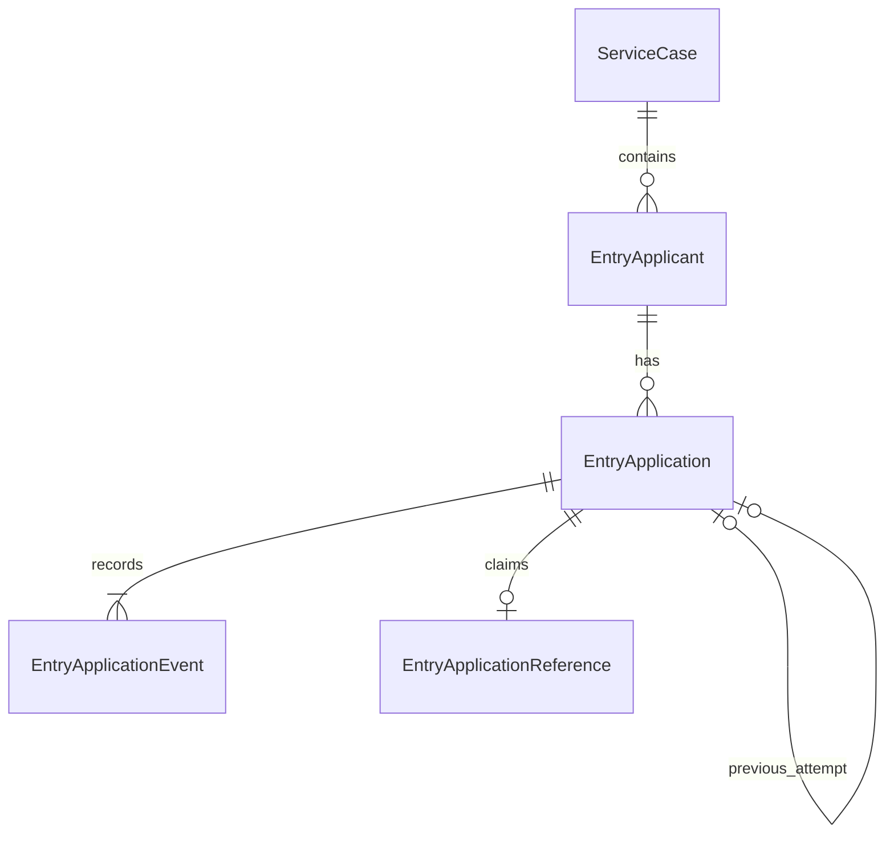

# E6-01A — заявители, отдельные подачи и журнал фактов

Начато 09.10.2026 · CRITICAL / solo · **PARTIALLY_READY**.
Локальный ручной пилот; независимые review/audit и PostgreSQL runtime UNKNOWN.
Путь: визовая услуга → анкета въезда в Кыргызстан → «Заявители и подачи».

## Сверка с исходным PDF

§14.1 требует отдельной заявки на человека и документ; §14.3 X01 — новой связанной
подачи после отказа; §18.3 — отдельного заявителя; §18.8 — номера подачи и журнала
проверок/решений. Непосредственно сверены физические стр.63, 64 и 76 оригинала.

Реестр группирует шесть документов/процедур: виза; ЕР; резидент-карта; регистрация;
протокол нарушения; выездная виза L. Они относятся к четырём семействам из PDF:
визы, работа, пребывание, урегулирование. Это **не четыре опубликованных процесса**:
общий ручной журнал не заменяет V01–V25, W/R/L, исключения, обязательные документы,
согласия, оплаты, сроки или действия портала. Для протокола и других процедур
специфические результаты/переходы ещё требуют отдельного процесса; «одобрено» не
следует использовать как универсальный признак получения документа.

## Что работает

- У услуги отдельные пронумерованные заявители с ролью в группе. Контакт/плательщик
  не становится заявителем автоматически. Имена, паспорта, сканы, идентичность
  человека и согласия не добавляются без решения DEC-06. Роли пока не исправляются
  через интерфейс; удаление/слияние людей не реализовано.
- У каждого заявителя независимые заявки. Новая отдельная процедура получает свою
  цепочку попыток. Повтор после отказа/закрытия явно ссылается на прежнюю попытку,
  сохраняет человека и документ; номер попытки растёт. Ветвление повторов запрещено.
- Ручные факты: черновик → подано → доработка → повторно подано в той же попытке;
  затем одобрение или отказ. Закрытие записи в CRM возможно отдельно; оно не
  отменяет заявление на портале и не создаёт обязательств/возвратов денег.
- Фактическая дата, источник и явное подтверждение оператора обязательны. Даты не
  могут быть будущими или идти назад относительно предыдущего фактического события.
  Дата создания черновика не мешает переносу более ранней фактической подачи.
- Для e-Visa требуется reference из восьми заглавных латинских букв/цифр. Он уникален
  между всеми попытками/услугами, сохраняется при доработке и не переносится в новую
  попытку. Бумажная подача может не иметь этого номера. Исправление ошибочно
  закреплённого номера пока не реализовано; нельзя стирать аудит для его освобождения.
- Событие, источник, автор и время записи неизменяемы. Повтор с тем же ключом и
  содержимым возвращает исходный результат, даже если появились следующие события.
  Другие данные под тем же ключом и устаревшая версия дают конфликт без записи.
- Одобрение одного человека не закрывает остальных и не меняет коммерческую услугу.
  Оно не подтверждает проверку/передачу выданного документа. Список заявок разбит на
  страницы по 20; исторические попытки и события остаются доступными.

## Хранение / доступ / восстановление

Четыре добавленные таблицы: `entry_applicants`, `entry_applications`,
`entry_application_events`, `entry_application_references`. Типизированные FK связывают
case/applicant/procedure/previous attempt, уникальные ограничения защищают CAS,
ключи запросов, единственного преемника и portal reference. ORM update/delete и
bulk update/delete запрещены; чтение проверяет хеши, цепочку и reference-проекцию.
Защита не является криптографической подписью против администратора самой БД.

Последняя связь — только последовательность повторных попыток одного человека
и документа. Она не соединяет разных членов семьи или разные процедуры.

Именной full-admin, прежний выключенный по умолчанию KG-флаг, workday/write gates.
CSRF/HMAC связывают сессию, актора, услугу, действие, заявку, ревизию и ключ.
Строгий URLencoded POST до 8 KiB, ответы no-store/no-referrer, безопасное эхо ошибки.
На GET нет SQL-записей. PostgreSQL использует блокировку заявки (shared для чтения,
exclusive для записи); SQLite явно начинает транзакцию до чтения. Это исключает
смешивание событий одного commit с reference другого в локальной проверке.
Потерянное подтверждение commit восстанавливается повтором неизменённой формы.

Миграция `e6_applications_0017` добавляет только новые таблицы; существующие записи
не переносит. Откат берёт блокировку и отказывается удалять непустой реестр;
offline downgrade запрещён. Выполнялась только на временной синтетической SQLite.
PostgreSQL DDL проверен, исполнение/конкурентность PG16 остаются UNKNOWN.

При сбое ответа повторяется та же форма с тем же ключом. При конфликте следует
открыть актуальную заявку и сверить события. Если после будущего согласованного
релиза понадобится откат кода, новые таблицы с фактами сохраняются: пустой downgrade
не является способом удаления рабочего журнала. Изменения пилотного флага и
production-окружения требуют отдельного разрешения; в этом этапе они не выполнялись.

## Проверки и остаток

Точные результаты/коммит — в handoff из `ai/STATE.md`. Domain/HTTP/migration/browser
тесты проверяют независимость двух людей и документов, доработку/повтор, чужие ID,
дубли/состязание, разрыв ответа после commit, повреждение, неизменяемость, пагинацию,
mobile390/desktop1365 без JS и печать. Проверка SQLite включает foreign_keys=ON.

Остаются настоящие профили заявителей/документы/согласия, привязка индивидуальной
анкеты и истории, продукт/подтип визы и канал подачи, тарифы, частные причины
закрытия и полные исключения, агрегат услуги, четыре исполняемых процесса,
дедлайны/задачи, приём писем и клиентский handoff. Реестр не подключён к боту,
реальным данным или production. Прежние доступы сотрудников не расширены.
